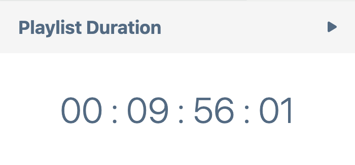
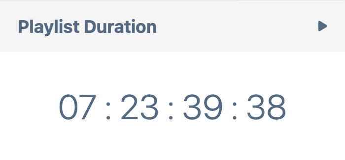

# Playlist Time Calculator

## Description

The Playlist Time Calculator is a browser extension that allows you to easily calculate the total time required to cover a YouTube playlist. With this extension, you can get instant insights into your watch time without leaving the YouTube page.

## Installation

1. Clone or download the repository.
2. Open your browser and go to `chrome://extensions/`.
3. Enable "Developer mode" in the top right.
4. Click "Load unpacked" and select the extension folder.

## Usage

1. Navigate to any YouTube playlist.
2. Click on the extension icon in the browser toolbar.
3. The popup will display the calculated total playlist time.

## Screenshots

## Contact

For any inquiries or support, please contact [mohamedbehiani15@gmail.com].
